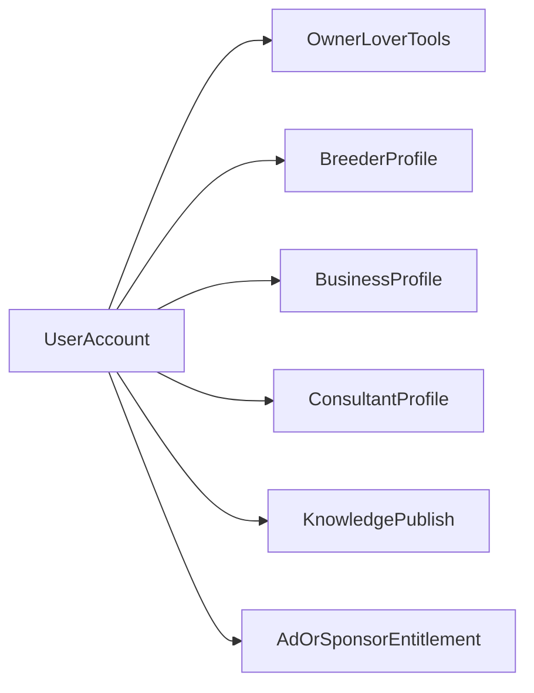

# Audience and capabilities (future design)

Living notes for product scope beyond the current “pet lovers” MVP.  
**v1 today** remains one account type with social + gallery + feed + marketplace.  
Everything below is **direction for later waves** — design so we do not paint ourselves into a single `role` enum.

## Core idea

The site is a **club / community platform** where the baseline member is an animal lover, but the same account can gradually unlock **capabilities** (profiles, tools, publish rights, billing) depending on how they participate.

A person or organization may wear **several hats at once** (e.g. owner + breeder + occasional advertiser; clinic + consultant + knowledge publisher). Capabilities are **additive**, not exclusive signup roles.

## Audiences

| Audience | Who | Why they use the site | Capability direction (later) |
|----------|-----|------------------------|------------------------------|
| **Pet lovers / owners** | Everyday members (current MVP focus) | Gallery, feed, classifieds, learning, ask experts | Base account: social, pets, listings, inquiries |
| **Breeders** | Breeding programs, kennels/catteries as people or orgs | Showcase lines, litters, match owners, marketplace for animals/services | Breeder profile, litter/listing tools, verification later |
| **Businesses** | Vet clinics, pet shops, pet hotels, groomers, kennels, training schools, etc. | Presence, services, trust, local discovery, content | Business / venue profile, service catalog, hours, contact |
| **Consultants / specialists** | Vets, behaviorists, trainers, nutritionists — often also clinic staff | Advise owners and breeders; bookings / Q&A | Consultant profile, lite cabinet, consultations catalog |
| **Knowledge publishers** | Clinics, specialists, experienced members | Blogs, articles: care, treatment, disease prevention, training, breeding practice | Verified publish rights for Learn / articles (not raw feed ads) |
| **Advertisers** | External brands or members promoting offers | Reach the club audience | Ad placements, campaigns, billing cabinet |
| **Investors / sponsors** | Parties funding visibility (optional model) | Support the club; get placement as return | Sponsorship packages, “fee as investment” placements — product/legal TBD |
| **Club advertisers (members)** | Any member who pays (or earns) placement | Promote their pets, litters, services, events | Same ad tools as advertisers, tied to member account |

Guests browse public surfaces; logged-in members use interactive tools. Exact guest vs member matrix stays in [product-vision.md](./product-vision.md).

## Capability model (architecture principle)

- **One user account** (`users` + `user_auth`). No “I am a clinic” vs “I am a lover” forced at registration.
- Extra participation = **attached capability records**, e.g.:
  - `breeder_profiles`
  - `business_profiles` (clinic, shop, kennel, …)
  - `consultant_profiles`
  - `publisher` / verified content flags
  - `advertiser_accounts` / campaign entitlements
- UI surfaces unlock when a capability exists (or after verification / payment), not because of a global role string.
- Same person can be owner + breeder + consultant; a clinic account can be business + publisher + consultant pool for its staff.

## Content and expertise

- **Feed** stays informal social posts (already built). Paid/structured promo should not masquerade as normal posts long-term.
- **Learn / articles / blogs** (later): professional and educational content — care, treatment, prophylaxis, training, breeding practice — from clinics, specialists, and other verified contributors.
- **Consultations catalog** (later): discover consultants; owners and breeders can ask / book; consultants reply in a lite cabinet. See product vision.
- Breeders and businesses may also publish educational pieces when verified, not only “sell” surfaces.

## Advertising and sponsorship (open questions)

Documented so we remember the business options; decisions still TBD:

1. **Classic paid ads** — advertisers buy placements (banner, promoted listing, sponsored article).
2. **Member-funded promo** — club members pay for boosts of their own listings/content.
3. **Sponsorship / “fee as investment”** — fee grants placement and/or longer-term partnership benefits (legal/commercial model TBD; may or may not involve equity-style “investors”).
4. **Organic free visibility** — ranking benefits, badges, or organic reach without payment (separate from paid slots).

Until billing exists, marketplace “promoted/benefit” ranking is a product placeholder only (see current next focus: marketplace filters/ranking).

## What this means for development order

1. Keep shipping **owner / lover MVP** (gallery, feed, marketplace, inquiries) without role enums.
2. When expanding: add **capability tables + verification**, not new signup role pickers.
3. Next documented product focus remains **marketplace ranking + filters** (useful for lovers, breeders, and businesses alike).
4. After that, natural waves: **business/breeder profiles** → **consultations + Learn articles** → **ads/sponsorship billing**.

## Related docs

- [product-vision.md](./product-vision.md) — v1 decisions and deferred list
- [marketplace-notifications.md](./marketplace-notifications.md) — listing inquiry alerts
- [mvp-stabilization-sprint.md](./mvp-stabilization-sprint.md) — latest stabilization cycle
